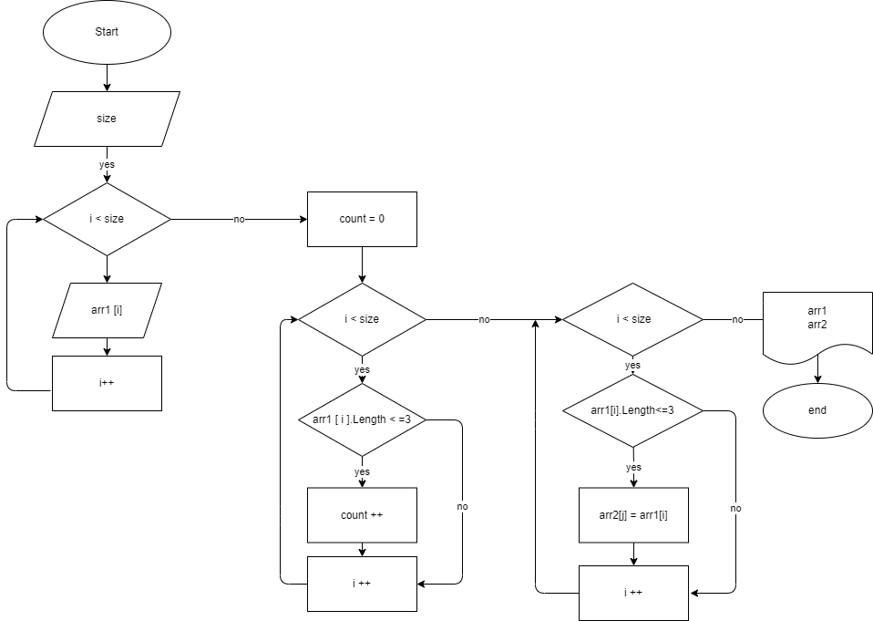

# Задача.

Написать программу, которая из имеющегося массива строк формирует массив из строк,  длина которых меньше либо равна 3 символа. Первоначальный массив можно ввести с клавиатуры, либо задать на старте выполнения алгоритма. При решении не рекомендуется пользоваться коллекциями, лучше обойтись исключительно массивами.

# Алгоритм.
1. Запрос у пользователя размер массива.
2. Ввод пользователем элементов массива.
3. Определение размера нового массива, путем подсчета количества элементов удовлетворяющих требованию.
4. Заполнение нового массива.
5. Вывод исходного массива.
6. Вывод нового массива.

# Блок схема.

# Пример результата работы программы.
[245, 32111, 6457, 1, 2, 42 ]->[245, 1, 2, 42 ]